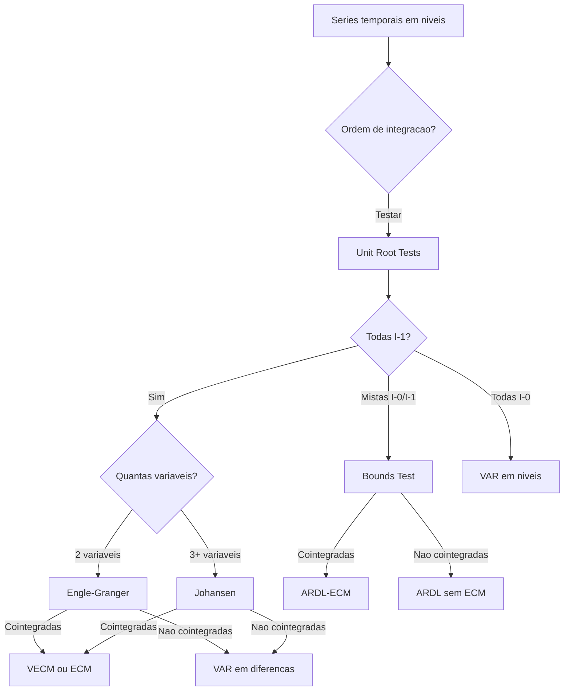

# Cointegration Tests

!!! info "Quick Reference"
    **Modulo:** `chronobox.tests_stat.cointegration`, `chronobox.models.vecm.VECM`
    **Objetivo:** Verificar se series $I(1)$ compartilham relacoes de equilibrio de longo prazo
    **R equivalente:** `urca::ca.jo()`, `tseries::po.test()`, `ARDL::bounds_test()`
    **Retorno:** `TestResult` / `JohansenResults` com estatisticas, valores criticos e decisao

## O Que e Cointegracao?

Duas ou mais series temporais $I(1)$ sao **cointegradas** quando existe uma combinacao linear entre elas que e $I(0)$ (estacionaria). Formalmente:

$$\boldsymbol{\beta}^\top \mathbf{y}_t \sim I(0), \quad \text{onde } \mathbf{y}_t \sim I(1)$$

O vetor $\boldsymbol{\beta}$ e chamado **vetor de cointegracao** e representa a relacao de equilibrio de longo prazo entre as variaveis.

!!! note "Intuicao Economica"
    Cointegracao captura a ideia de que variaveis podem se mover juntas no longo prazo, mesmo que individualmente sejam nao-estacionarias. Desvios do equilibrio sao temporarios — o sistema sempre retorna a vizinhanca da relacao estavel.

    **Exemplos classicos:**

    - Consumo e renda disponivel (hipotese da renda permanente)
    - Taxas de juros de curto e longo prazo (estrutura a termo)
    - Precos spot e futures (lei do preco unico)
    - Taxa de cambio e fundamentos macro (PPP)

## Por Que Testar Cointegracao?

1. **VAR vs VECM**: Se as series sao cointegradas, um VAR em diferencas perde informacao de longo prazo. O VECM e o modelo correto
2. **Regressao espuria**: Regredir series $I(1)$ nao cointegradas produz resultados significativos mas sem sentido economico (Granger & Newbold, 1974)
3. **Relacoes de longo prazo**: Cointegracao permite estimar e testar hipoteses sobre equilibrios economicos
4. **Previsao**: Modelos com correcao de erros (ECM) geralmente preveem melhor do que modelos puramente em diferencas

## Tres Abordagens

O chronobox oferece tres abordagens complementares para testar cointegracao:

| Teste | Metodo | Variaveis | Vantagem Principal |
|:------|:-------|:----------|:-------------------|
| [Johansen](johansen.md) | Likelihood ratio | Multiplas $I(1)$ | Detecta multiplas relacoes de cointegracao |
| [Engle-Granger](engle-granger.md) | Residuos ADF | 2 variaveis $I(1)$ | Simples, intuitivo |
| [Bounds Test](bounds-test.md) | ARDL-ECM (F-test) | Mistas $I(0)/I(1)$ | Nao exige pre-teste de raiz unitaria |

!!! warning "Pre-requisito: Ordem de Integracao"
    Antes de testar cointegracao com Johansen ou Engle-Granger, confirme que todas as series sao $I(1)$ usando [testes de raiz unitaria](../unit-root/index.md). O Bounds test e a excecao — funciona com ordens de integracao mistas.

## Arvore de Decisao



## Rank de Cointegracao

Se $\mathbf{y}_t$ e um vetor $K$-dimensional de variaveis $I(1)$, o **rank de cointegracao** $r$ e o numero de vetores de cointegracao linearmente independentes ($0 \leq r \leq K$):

| Rank | Interpretacao | Modelo |
|:-----|:-------------|:-------|
| $r = 0$ | Nenhuma cointegracao | VAR em diferencas |
| $0 < r < K$ | $r$ relacoes de cointegracao | VECM com rank $r$ |
| $r = K$ | Todas estacionarias | VAR em niveis |

## Exemplo Rapido

```python
import numpy as np
from chronobox.models.vecm import VECM

# Gerar dados cointegrados: y2 = 2*y1 + ruido estacionario
np.random.seed(42)
T = 250
e = np.random.randn(T)
y1 = np.cumsum(np.random.randn(T))  # I(1)
y2 = 2 * y1 + e                     # Cointegrada com y1

data = np.column_stack([y1, y2])

# Teste de Johansen
model = VECM(lags=2, deterministic="co")
joh = model.johansen_test(data)
print(joh.summary())

# Decisao
print(f"\nRank (trace test): {joh.rank_trace}")
print(f"Rank (max-eigenvalue): {joh.rank_maxeig}")
```

## See Also

- [Johansen Test](johansen.md) — Procedimento de Johansen (trace e max-eigenvalue)
- [Engle-Granger Test](engle-granger.md) — Teste em dois passos para relacoes bivariadas
- [Bounds Test](bounds-test.md) — Teste ARDL para ordens de integracao mistas
- [Unit Root Tests](../unit-root/index.md) — Pre-requisito: determinar ordem de integracao
- [User Guide: VECM](../../user-guide/var/vecm.md) — Modelagem VECM
- [Theory: VECM & Cointegracao](../../theory/vecm-theory.md) — Fundamentos teoricos

## Referencias

- Engle, R.F. & Granger, C.W.J. (1987). "Co-integration and error correction: representation, estimation, and testing." *Econometrica*, 55(2), 251-276.
- Johansen, S. (1991). "Estimation and hypothesis testing of cointegration vectors in Gaussian vector autoregressive models." *Econometrica*, 59(6), 1551-1580.
- Pesaran, M.H., Shin, Y. & Smith, R.J. (2001). "Bounds testing approaches to the analysis of level relationships." *Journal of Applied Econometrics*, 16(3), 289-326.
- Granger, C.W.J. & Newbold, P. (1974). "Spurious regressions in econometrics." *Journal of Econometrics*, 2(2), 111-120.
