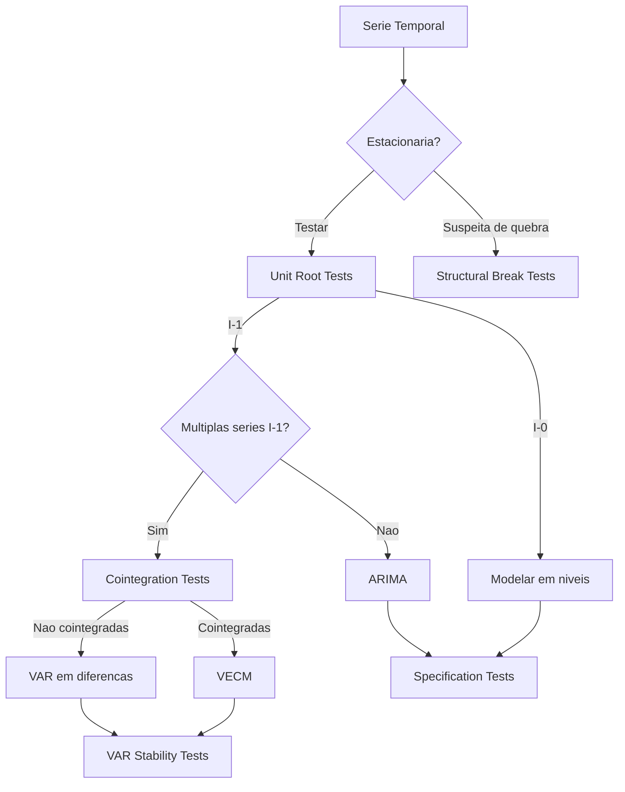

# Diagnosticos

!!! info "Quick Reference"
    **Modulo:** `chronobox.tests_stat`
    **Objetivo:** Validar pressupostos e propriedades das series antes e apos a modelagem
    **R equivalente:** pacotes `urca`, `tseries`, `strucchange`, `vars`

## Visao Geral

A modelagem de series temporais depende de pressupostos sobre a natureza dos dados.
Testes de diagnostico sao ferramentas essenciais para:

- **Determinar a ordem de integracao** antes de escolher entre ARIMA, VAR ou VECM
- **Verificar cointegracao** para modelagem de relacoes de longo prazo
- **Detectar quebras estruturais** que podem invalidar estimativas
- **Validar especificacao** dos modelos estimados
- **Verificar estabilidade** de modelos VAR

## Categorias de Testes

### :material-chart-timeline: [Unit Root Tests](unit-root/index.md)

Testes para determinar se a serie e estacionaria ou possui raiz unitaria (I(1)).
Fundamentais para decidir se a serie precisa ser diferenciada.

| Teste | H₀ | Uso Principal |
|:------|:---|:-------------|
| [ADF](unit-root/adf.md) | Raiz unitaria | Teste padrao, selecao automatica de lags |
| [Phillips-Perron](unit-root/pp.md) | Raiz unitaria | Robusto a heteroscedasticidade |
| [KPSS](unit-root/kpss.md) | **Estacionaria** | Confirmacao (hipotese invertida) |
| [Zivot-Andrews](unit-root/zivot-andrews.md) | Raiz unitaria | Uma quebra estrutural endogena |
| [Lee-Strazicich](unit-root/lee-strazicich.md) | Raiz unitaria com quebras | Duas quebras estruturais |

### :material-link-variant: Cointegration Tests

Testes para verificar se series I(1) compartilham uma relacao de longo prazo.

| Teste | Metodo | Uso Principal |
|:------|:-------|:-------------|
| Johansen | Likelihood ratio | Sistemas multivariados (VAR/VECM) |
| Engle-Granger | Residuos | Relacao bivariada |
| Bounds Test | ARDL | Ordens de integracao mistas I(0)/I(1) |

### :material-chart-bell-curve-cumulative: Structural Breaks

Testes para detectar mudancas estruturais nos parametros do modelo.

| Teste | Tipo | Uso Principal |
|:------|:-----|:-------------|
| CUSUM | Sequencial | Instabilidade cumulativa de parametros |
| Chow | Ponto conhecido | Quebra em data especifica |
| Bai-Perron | Multiplas quebras | Deteccao de multiplas datas de quebra |

### :material-clipboard-check: Specification Tests

Testes para validar a especificacao do modelo estimado.

| Teste | Verifica | Uso Principal |
|:------|:---------|:-------------|
| Ljung-Box | Autocorrelacao residual | Adequacao do modelo ARIMA |
| Breusch-Godfrey | Correlacao serial | Modelos de regressao |
| ARCH Test | Heteroscedasticidade condicional | Volatilidade |
| Jarque-Bera | Normalidade | Validade de intervalos de confianca |
| Lag Selection | Ordem otima | Selecao AIC/BIC/HQ |

### :material-sine-wave: VAR Stability

Testes especificos para modelos VAR estimados.

| Teste | Verifica | Uso Principal |
|:------|:---------|:-------------|
| Eigenvalue Stability | Raizes caracteristicas | Estabilidade do sistema |
| Granger Causality | Causalidade direcional | Relacoes entre variaveis |
| Portmanteau | Autocorrelacao multivariada | Adequacao do modelo VAR |

## Quando Usar Cada Categoria



## Fluxo Recomendado

1. **Testar raiz unitaria** com ADF + KPSS para cada serie
2. **Confirmar com Phillips-Perron** se houver suspeita de heteroscedasticidade
3. **Testar quebras estruturais** com Zivot-Andrews se houver eventos conhecidos
4. **Testar cointegracao** se multiplas series sao I(1)
5. **Estimar modelo** (ARIMA, VAR, VECM)
6. **Validar especificacao** com testes nos residuos
7. **Verificar estabilidade** para modelos VAR

## Exemplo Rapido

```python
import numpy as np
from chronobox.tests_stat.unit_root import adf_test, kpss_test

# Gerar serie com tendencia estocastica (random walk)
np.random.seed(42)
y = np.cumsum(np.random.randn(200))

# Bateria de testes de raiz unitaria
adf = adf_test(y, regression="c")
kpss = kpss_test(y, regression="c")

print(adf.summary())
print(kpss.summary())

# Decisao
if not adf.reject_at_5pct and kpss.reject_at_5pct:
    print("Serie e I(1) — diferenciar antes de modelar")
elif adf.reject_at_5pct and not kpss.reject_at_5pct:
    print("Serie e I(0) — modelar em niveis")
else:
    print("Resultados ambiguos — investigar mais")
```

## See Also

- [Unit Root Tests](unit-root/index.md) — Testes de estacionaridade
- [User Guide: ARIMA](../user-guide/arima/arima.md) — Modelagem ARIMA
- [User Guide: VAR](../user-guide/var/var.md) — Modelos VAR
- [Theory: ARIMA](../theory/arima-theory.md) — Fundamentos teoricos ARIMA
