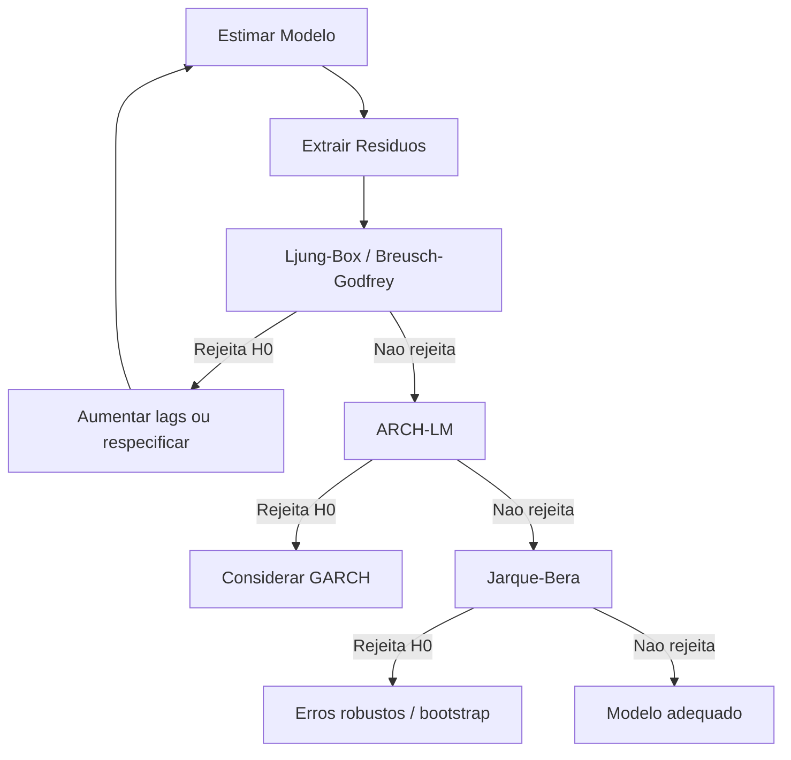

# Specification Tests

!!! info "Quick Reference"
    **Modulo:** `chronobox.tests_stat.specification`
    **Objetivo:** Verificar se os residuos do modelo atendem as hipoteses necessarias
    **R equivalente:** `Box.test()`, `lmtest::bgtest()`, `FinTS::ArchTest()`, `tseries::jarque.bera.test()`
    **Retorno:** `TestResult` com estatistica, p-valor, valores criticos e decisao

## O Que Sao Testes de Especificacao?

Testes de especificacao avaliam se um modelo estimado satisfaz as **hipoteses subjacentes**. Na pratica, isso significa verificar se os residuos $\hat{e}_t = y_t - \hat{y}_t$ comportam-se como **ruido branco**:

$$\hat{e}_t \sim WN(0, \sigma^2)$$

Um residuo ideal deve ser:

1. **Nao autocorrelacionado**: $\text{Cov}(\hat{e}_t, \hat{e}_{t-k}) = 0$ para todo $k \neq 0$
2. **Homocedastico**: $\text{Var}(\hat{e}_t) = \sigma^2$ constante
3. **Normalmente distribuido**: $\hat{e}_t \sim N(0, \sigma^2)$

Se alguma dessas propriedades e violada, o modelo esta **mal especificado** — as estimativas podem ser enviesadas, os erros-padrao incorretos e os intervalos de confianca invalidos.

## Por Que Testar?

| Propriedade Violada | Consequencia | Teste |
|:--------------------|:-------------|:------|
| Autocorrelacao residual | Erros-padrao subestimados, inferencia invalida | [Ljung-Box](ljung-box.md), [Breusch-Godfrey](breusch-godfrey.md) |
| Heterocedasticidade condicional | Intervalos de confianca incorretos, eficiencia perdida | [ARCH-LM](arch-test.md) |
| Nao-normalidade | Testes t e F aproximados, previsao pontual nao afetada | [Jarque-Bera](jarque-bera.md) |
| Ordem incorreta do modelo | Dinamica mal capturada, previsoes ruins | [Selecao de Lags](lag-selection.md) |

## Categorias

### Autocorrelacao Residual

Testa se os residuos possuem correlacao serial, indicando que o modelo nao capturou toda a dinamica da serie.

- **[Ljung-Box](ljung-box.md)** — Teste portmanteau baseado em autocorrelacoes amostrais. Simples, amplamente usado, funciona para qualquer modelo.
- **[Breusch-Godfrey](breusch-godfrey.md)** — Teste LM via regressao auxiliar. Superior ao Durbin-Watson quando ha variaveis dependentes defasadas entre os regressores.

### Heterocedasticidade Condicional

Testa se a variancia dos residuos muda ao longo do tempo de forma previsivel (efeitos ARCH).

- **[ARCH-LM](arch-test.md)** — Testa efeitos ARCH nos residuos ao quadrado. Se rejeitado, considere modelos GARCH.

### Normalidade

Testa se os residuos seguem uma distribuicao normal — hipotese necessaria para a validade exata de testes t e F em amostras finitas.

- **[Jarque-Bera](jarque-bera.md)** — Testa normalidade via skewness e kurtosis. O teste mais utilizado em econometria.

### Selecao de Ordem do Modelo

Ferramentas para escolher o numero otimo de lags (defasagens) do modelo.

- **[Selecao de Lags](lag-selection.md)** — Criterios de informacao (AIC, BIC, HQIC, FPE) e teste LR sequencial para modelos VAR.

## Workflow Recomendado



!!! tip "Ordem dos Testes"
    Comece pela **autocorrelacao** (mais grave — afeta consistencia), depois **heterocedasticidade** (afeta eficiencia) e por ultimo **normalidade** (menos critica em amostras grandes pelo CLT).

## Exemplo Rapido: Bateria de Diagnosticos

```python
import numpy as np
from chronobox.tests_stat.specification import (
    ljung_box_test,
    breusch_godfrey_test,
    arch_lm_test,
    jarque_bera_test,
)

# Residuos de um modelo ARIMA(1,0,0) estimado
np.random.seed(42)
residuals = np.random.randn(200)  # residuos bem-comportados

# 1. Autocorrelacao
lb = ljung_box_test(residuals, lags=10, model_df=1)
print(f"Ljung-Box:      Q={lb.statistic:.4f}, p={lb.pvalue:.4f} -> "
      f"{'Rejeita' if lb.reject_at_5pct else 'Nao rejeita'} H0")

# 2. Heterocedasticidade
arch = arch_lm_test(residuals, nlags=5)
print(f"ARCH-LM:        LM={arch.statistic:.4f}, p={arch.pvalue:.4f} -> "
      f"{'Rejeita' if arch.reject_at_5pct else 'Nao rejeita'} H0")

# 3. Normalidade
jb = jarque_bera_test(residuals)
print(f"Jarque-Bera:    JB={jb.statistic:.4f}, p={jb.pvalue:.4f} -> "
      f"{'Rejeita' if jb.reject_at_5pct else 'Nao rejeita'} H0")
```

## See Also

- [Unit Root Tests](../unit-root/index.md) — Testes de raiz unitaria
- [Cointegration Tests](../cointegration/index.md) — Testes de cointegracao
- [Structural Breaks](../structural-breaks/index.md) — Testes de quebra estrutural
- [Diagnosticos](../index.md) — Visao geral de todos os testes

## Referencias

- Ljung, G.M. & Box, G.E.P. (1978). "On a measure of lack of fit in time series models." *Biometrika*, 65(2), 297-303.
- Breusch, T.S. (1978). "Testing for autocorrelation in dynamic linear models." *Australian Economic Papers*, 17(31), 334-355.
- Engle, R.F. (1982). "Autoregressive conditional heteroscedasticity with estimates of the variance of United Kingdom inflation." *Econometrica*, 50(4), 987-1007.
- Jarque, C.M. & Bera, A.K. (1980). "Efficient tests for normality, homoscedasticity and serial independence of regression residuals." *Economics Letters*, 6(3), 255-259.
