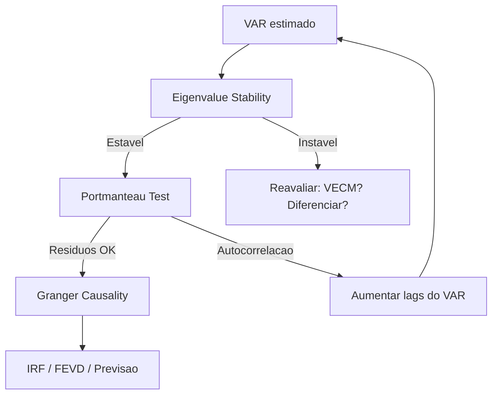

# VAR Stability

!!! info "Quick Reference"
    **Modulo:** `chronobox.models.var.VARResults`
    **Objetivo:** Verificar estabilidade, causalidade e adequacao residual de modelos VAR estimados
    **R equivalente:** pacote `vars` — `roots()`, `causality()`, `serial.test()`

## O Que e Estabilidade de um VAR?

Um VAR(p) com $K$ variaveis e definido por:

$$\mathbf{y}_t = \mathbf{c} + \mathbf{A}_1 \mathbf{y}_{t-1} + \mathbf{A}_2 \mathbf{y}_{t-2} + \cdots + \mathbf{A}_p \mathbf{y}_{t-p} + \mathbf{u}_t$$

O sistema e **estavel** (estacionario) se e somente se todos os eigenvalues da **companion matrix** $\mathbf{A}_c$ possuem modulo estritamente menor que 1:

$$|\lambda_i| < 1 \quad \forall \, i = 1, \ldots, Kp$$

Graficamente, todos os eigenvalues devem estar **dentro do circulo unitario** no plano complexo.

## Por Que Estabilidade Importa?

A estabilidade e uma condicao **necessaria** para que o VAR tenha propriedades bem definidas:

| Propriedade | VAR Estavel | VAR Instavel |
|:------------|:------------|:-------------|
| Previsao | Converge para a media | Diverge ou explode |
| IRF | Decai para zero | Nao decai — efeitos permanentes |
| FEVD | Soma a 100% em cada horizonte | Pode nao convergir |
| Covariancia | Estacionaria (constante) | Nao-estacionaria |
| Media incondicional | Existe e e finita | Nao existe |

!!! warning "Estabilidade vs. Cointegracao"
    Um VAR em **niveis** com variaveis I(1) sera instavel por construcao — tera eigenvalues com $|\lambda| = 1$. Isso **nao e um problema** se as variaveis sao cointegradas: nesse caso, o modelo correto e o **VECM**, que incorpora as relacoes de longo prazo. Veja [VECM & Cointegracao](../../theory/vecm-theory.md).

## Testes Disponiveis

### :material-circle-outline: [Eigenvalue Stability](eigenvalue.md)

Verifica se todos os eigenvalues da companion matrix estao dentro do circulo unitario.
E o teste fundamental de estabilidade do sistema.

- **Resultado:** Booleano (`is_stable`) + plot no plano complexo
- **Quando usar:** Sempre, apos estimar qualquer VAR

### :material-arrow-right-bold: [Granger Causality](granger-causality.md)

Testa se uma variavel ajuda a prever outra no contexto do VAR.
Implementa testes F (Wald) e LR para restricoes de exclusao.

- **H₀:** Variavel X nao Granger-causa variavel Y
- **Quando usar:** Para entender relacoes direcionais entre variaveis

### :material-format-list-checks: [Portmanteau Test](portmanteau.md)

Testa se os residuos do VAR sao white noise multivariado.
Generaliza o teste Ljung-Box para o contexto multivariado.

- **H₀:** Residuos sao white noise multivariado
- **Quando usar:** Para validar a especificacao do modelo

## Tabela Comparativa

| Teste | O Que Verifica | Estatistica | Distribuicao |
|:------|:---------------|:------------|:-------------|
| [Eigenvalue](eigenvalue.md) | Estabilidade do sistema | $\max |\lambda_i|$ | — (deterministica) |
| [Granger Causality](granger-causality.md) | Causalidade direcional | $F$, $W$ | $F(p, T' - Kp - d)$, $\chi^2(p)$ |
| [Portmanteau](portmanteau.md) | Autocorrelacao residual | $Q_h$ | $\chi^2(K^2(h - p))$ |

## Fluxo Recomendado



1. **Verificar estabilidade** — se instavel, reconsiderar a especificacao
2. **Testar whiteness dos residuos** — se autocorrelados, aumentar lags
3. **Testar causalidade** — entender relacoes entre variaveis
4. **Prosseguir com analise** — IRF, FEVD, previsao

## Exemplo Rapido

```python
import numpy as np
from chronobox.models.var import VAR

# Dados simulados: VAR(2) bivariado estavel
np.random.seed(42)
T = 300
y = np.zeros((T, 2))
for t in range(2, T):
    y[t, 0] = 0.5 * y[t-1, 0] + 0.1 * y[t-1, 1] + np.random.randn()
    y[t, 1] = 0.2 * y[t-1, 0] + 0.3 * y[t-1, 1] + np.random.randn()

# Estimar VAR(2)
model = VAR(y, names=["X", "Y"])
results = model.fit(maxlags=2)

# 1. Estabilidade
print(f"Estavel: {results.is_stable}")
print(f"Max |eigenvalue|: {np.max(np.abs(results.roots)):.4f}")

# 2. Portmanteau
wn = results.test_whiteness(nlags=10)
print(f"Portmanteau Q: {wn['statistic']:.4f}, p={wn['pvalue']:.4f}")

# 3. Granger causality
gc = results.test_granger("Y", "X")
print(f"X -> Y: F={gc.fstat:.4f}, p={gc.pvalue:.4f}, {gc}")
```

## See Also

- [Diagnostics Overview](../index.md) — Visao geral de todos os testes
- [VAR Theory](../../theory/var-theory.md) — Algebra do VAR
- [User Guide: VAR](../../user-guide/var/var.md) — Como estimar modelos VAR
- [Specification Tests](../specification/index.md) — Testes univariados de especificacao
