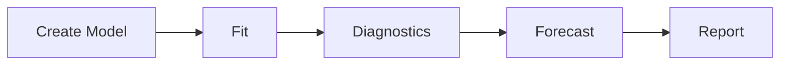

# Core Concepts

## Time Series Data

ChronoBox works with pandas Series and DataFrames. Univariate models
accept `pd.Series`, multivariate models accept `pd.DataFrame`.

```python
import pandas as pd
from chronobox.core import TimeSeriesData

# Wrap raw data
ts = TimeSeriesData(pd.Series([1.0, 2.0, 3.0]))
```

## Model Fitting Workflow

1. **Create model**: Specify model type and parameters
2. **Fit model**: Call `.fit(data)` to estimate parameters
3. **Diagnostics**: Check residuals, information criteria
4. **Forecast**: Generate out-of-sample predictions
5. **Report**: Generate HTML reports



## Information Criteria

ChronoBox supports four information criteria for model comparison:

- **AIC**: Akaike Information Criterion - balances fit and complexity
- **BIC**: Bayesian Information Criterion (Schwarz) - penalizes complexity more
- **AICc**: Corrected AIC for small samples
- **HQIC**: Hannan-Quinn Information Criterion

Lower values indicate better models.

## Stationarity

Many models require stationary data. Use unit root tests (ADF, KPSS)
to check, and differencing to achieve stationarity.

```python
from chronobox.tests_stat import adf_test

result = adf_test(data)
if result.p_value > 0.05:
    print("Series is non-stationary, differencing needed")
```

## Lag Polynomials

ChronoBox uses lag polynomial notation internally:

- AR polynomial: $\phi(B) = 1 - \phi_1 B - \cdots - \phi_p B^p$
- MA polynomial: $\theta(B) = 1 + \theta_1 B + \cdots + \theta_q B^q$

where $B$ is the backshift operator ($B y_t = y_{t-1}$).
