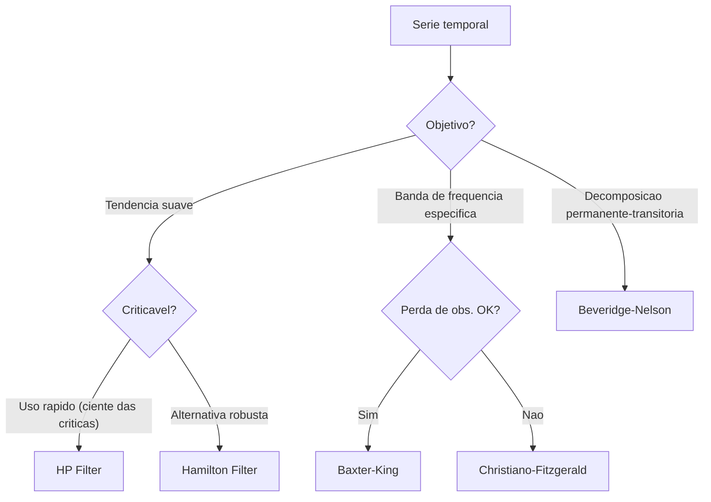

# Filtros Economicos

!!! info "Quick Reference"
    - **Modulo**: `chronobox.filters`
    - **Import**: `from chronobox.filters import hp_filter, bk_filter, cf_filter, hamilton_filter, bn_decomposition`
    - **R equivalente**: `mFilter::hpfilter()`, `mFilter::bkfilter()`, `mFilter::cffilter()`

---

## Overview

Filtros economicos sao ferramentas fundamentais em macroeconomia para decompor uma
serie temporal $y_t$ em dois componentes nao observaveis:

$$
y_t = \tau_t + c_t
$$

onde $\tau_t$ e a **tendencia** (componente de longo prazo) e $c_t$ e o **ciclo**
(componente de curto prazo ou flutuacoes ciclicas).

Essa decomposicao e essencial para:

- **Politica monetaria**: estimar o hiato do produto (output gap)
- **Politica fiscal**: separar receitas estruturais de ciclicas
- **Analise conjuntural**: identificar a posicao no ciclo economico
- **Pesquisa academica**: estudar propriedades dos ciclos de negocios

### O Problema

Series macroeconomicas como PIB, producao industrial e emprego misturam
movimentos de diferentes frequencias. O desafio e separar a tendencia secular
(crescimento de longo prazo) das flutuacoes ciclicas (expansoes e recessoes)
sem observar diretamente nenhum dos dois componentes.

---

## Dominio do Tempo vs Dominio da Frequencia

Filtros economicos podem ser entendidos em dois dominios:

**Dominio do tempo**: o filtro opera diretamente sobre os valores $y_t$,
aplicando pesos a observacoes adjacentes para extrair o componente desejado.

**Dominio da frequencia**: o filtro seleciona bandas de frequencia especificas.
Uma serie temporal pode ser representada como soma de oscilacoes de diferentes
frequencias (decomposicao de Fourier). Um filtro band-pass, por exemplo,
preserva apenas as frequencias entre $\omega_L$ e $\omega_H$:

$$
|G(\omega)| =
\begin{cases}
1 & \text{se } \omega_L \leq \omega \leq \omega_H \\
0 & \text{caso contrario}
\end{cases}
$$

Na pratica, ciclos de negocios correspondem a flutuacoes com periodicidade
entre 6 e 32 trimestres (1.5 a 8 anos), conforme a definicao classica de
Burns e Mitchell (1946).

---

## Tabela Comparativa

| Filtro | Tipo | Obs. Perdidas | Parametro-chave | Melhor Uso |
|---|---|---|---|---|
| [Hodrick-Prescott](hp.md) | High-pass | 0 | $\lambda$ | Uso geral (controverso) |
| [Baxter-King](bk.md) | Band-pass | $2K$ | `low`, `high`, `K` | Ciclos de negocios |
| [Christiano-Fitzgerald](cf.md) | Band-pass | 0 | `low`, `high` | Band-pass sem perda de obs. |
| [Hamilton](hamilton.md) | Regressao | $h + p - 1$ | $h$, $p$ | Alternativa moderna ao HP |
| [Beveridge-Nelson](bn.md) | ARIMA | 0 | $p$, $q$ | Decomposicao permanente-transitoria |

### Quando usar cada filtro



---

## Quick Example

```python
import matplotlib.pyplot as plt
from chronobox.datasets import load_dataset
from chronobox.filters import hp_filter, bk_filter, cf_filter, hamilton_filter

# Carregar PIB trimestral dos EUA
gdp = load_dataset("us_gdp")
y = gdp.values

# Aplicar filtros
hp_trend, hp_cycle = hp_filter(y, frequency="quarterly")
bk_cycle = bk_filter(y, low=6, high=32, trunc=12)
cf_cycle = cf_filter(y, low=6, high=32)
ham_trend, ham_cycle = hamilton_filter(y, h=8, p=4)

# Comparar ciclos
fig, ax = plt.subplots(figsize=(12, 5))
ax.plot(hp_cycle, label="HP", alpha=0.8)
ax.plot(cf_cycle, label="CF", alpha=0.8)
ax.plot(ham_cycle, label="Hamilton", alpha=0.8)
ax.axhline(0, color="black", linewidth=0.5)
ax.set_title("Componentes Ciclicos --- Comparacao de Filtros")
ax.legend()
plt.tight_layout()
plt.show()
```

---

## Referencias

- Burns, A. F. & Mitchell, W. C. (1946). *Measuring Business Cycles*.
  NBER.
- Hodrick, R. J. & Prescott, E. C. (1997). Postwar U.S. Business Cycles:
  An Empirical Investigation. *Journal of Money, Credit and Banking*, 29(1), 1--16.
- Baxter, M. & King, R. G. (1999). Measuring Business Cycles: Approximate
  Band-Pass Filters for Economic Time Series. *Review of Economics and Statistics*,
  81(4), 575--593.
- Christiano, L. J. & Fitzgerald, T. J. (2003). The Band Pass Filter.
  *International Economic Review*, 44(2), 435--465.
- Hamilton, J. D. (2018). Why You Should Never Use the Hodrick-Prescott Filter.
  *Review of Economics and Statistics*, 100(5), 831--843.
- Beveridge, S. & Nelson, C. R. (1981). A New Approach to Decomposition of
  Economic Time Series into Permanent and Transitory Components.
  *Journal of Monetary Economics*, 7(2), 151--174.
